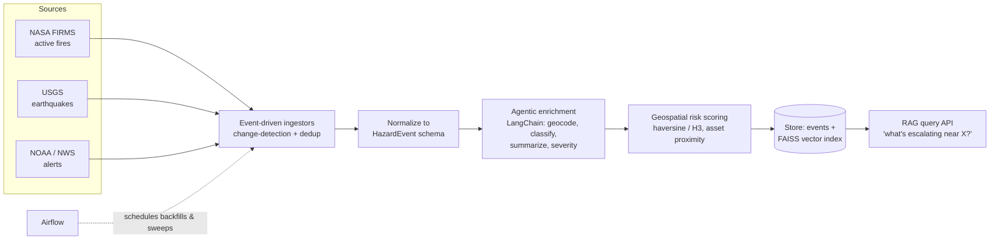

# Aegis — Event-Driven Disaster Intelligence Pipeline

[](https://github.com/VenkateswarluNagineni/aegis-disaster-intel/actions/workflows/ci.yml)
[](https://www.python.org/downloads/)
[](LICENSE)

Ingests **live public hazard feeds** (wildfires, earthquakes, severe weather), enriches
each event with an **agentic LLM workflow**, scores **geospatial risk**, and serves a
**RAG query layer** so an analyst can ask "what's escalating near these assets right now?"

Ingestion is **event-driven** — feeds fire updates that trigger processing — not naive
polling, with **change-detection and dedup** so the same event isn't reprocessed or
double-counted.

> Why it exists: disaster response needs *fresh, deduplicated, enriched, location-aware*
> signal. This pipeline mirrors that end to end on real open data.

## Architecture



## What makes it different

- **Event-driven, not polling** — change-detection on feed state; only new/changed events flow.
- **Agentic enrichment** — an LLM workflow geocodes, classifies hazard type, estimates
  severity, and writes an analyst-ready summary, with validation guards.
- **Geospatial-first** — proximity-to-asset risk scoring, not just a table of rows.
- **RAG over live events** — natural-language situational queries with citations.

## Tech stack

`Python 3.11` · `LangChain` (agentic enrichment) · `FAISS` · `GeoPandas / H3` ·
`Airflow` · real APIs: `NASA FIRMS`, `USGS`, `NOAA/NWS` · `Docker`

## Status

🚧 Built in public, in phases — see **[ROADMAP.md](ROADMAP.md)**. Each phase ships tested
code + a design note in [`docs/`](docs/).

## Quickstart

```bash
pip install -e ".[dev]"
pytest
```

## License

MIT © Venkateswarlu Nagineni
